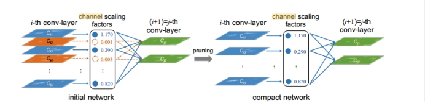

# README

# **项目介绍：**

在Oxford hand数据集上进行检测，并在此基础上对模型进行剪枝。通过剪枝，模型的参数量、模型大小减少80%，FLOPS降低70%，前向推断速度提高一倍，同时保持MAP（平均精度）基本不变。剪枝过程包括稀疏化训练、模型剪枝和微调，通过减少冗余参数和计算量，提升模型的推断效率。

# **项目文件目录：**

**——train.py**：训练脚本，负责读取数据、训练模型、保存模型权重。

**——test_prune.py**：模型剪枝脚本，负责剪枝模型并保存剪枝后的配置和权重文件。

**——test.py**：测试脚本，负责在验证集或测试集上评估模型性能

# **剪枝算法：**

本代码基于论文 Learning Efficient Convolutional Networks Through Network Slimming (ICCV 2017) 进行改进实现的 channel pruning算法，基于 BN 层的 gamma 系数进行剪枝。

 

## 算法原理：

加载预训练模型并评估其性能，然后收集BN层的gamma值并排序以确定剪枝阈值。通过设定的剪枝比例，移除gamma值小于阈值的通道，并评估剪枝后的模型性能。接着，计算每层的掩码，确定要保留的通道数，生成剪枝后的模型。然后初始化和微调剪枝后的模型，并在剪枝前后比较模型的参数数量、推理时间和mAP。最后，保存剪枝后的模型配置和权重。

## 稀疏化训练：

```python
def prune_and_eval(model, sorted_bn, percent=.0):
  model_copy = deepcopy(model)
  thre_index = int(len(sorted_bn) * percent)s
  thre = sorted_bn[thre_index]
  for idx in prune_idx:
    bn_module = model_copy.module_list[idx][1]
    mask = obtain_bn_mask(bn_module, thre)
    bn_module.weight.data.mul_(mask)
  mAP = eval_model(model_copy)[2].mean()
  return thre
```

## 剪枝：

```python
def obtain_filters_mask(model, thre, CBL_idx, prune_idx):

  num_filters = []

  filters_mask = []

  for idx in CBL_idx:

    bn_module = model.module_list[idx][1]

    mask = obtain_bn_mask(bn_module, thre).cpu().numpy()

    num_filters.append(int(mask.sum()))

    filters_mask.append(mask.copy())

  return num_filters, filters_mask
```

## 微调：

```python
init_weights_from_loose_model(compact_model, pruned_model, CBL_idx, Conv_idx, CBLidx2mask)
```

## 性能比较：

```python
compact_model_metric = eval_model(compact_model)

metric_table = [

  ["Metric", "Before", "After"],

  ["mAP", f'{origin_model_metric[2].mean():.6f}', f'{compact_model_metric[2].mean():.6f}'],

  ["Parameters", f"{origin_nparameters}", f"{compact_nparameters}"],

  ["Inference", f'{pruned_forward_time:.4f}', f'{compact_forward_time:.4f}']

]

print(AsciiTable(metric_table).table)
```

# **开始之前：**

## 1. **环境配置:**

### **1.1确保安装以下依赖：**

Python 3.6+

PyTorch 1.0+

### **1.2安装依赖：**

```python
pip install -r requirements.txt
```

## **2. 数据准备：**

### **2.1下载数据集：**

下载并解压Oxford手部数据集。

```python
mkdir -p data/oxford && cd data/oxford

Wget http://www.robots.ox.ac.uk/~vgg/data/hands/downloads/hand_dataset.tar.gz

tar -xvzf hand_dataset.tar.gz
```

### **2.2运行转换脚本：**

在data目录下执行converter.py，生成images、labels文件夹和train.txt、valid.txt文件：

```python
python converter.py
```

# **模型训练：**

## **3. 正常训练（Baseline）:**

### **3.1下载预训练权重：**

从官方YOLOv3下载预训练权重，放入weights目录中。

```python
mkdir -p weights

wget https://pjreddie.com/media/files/yolov3.weights -O weights/yolov3.weights
```

### **3.2训练模型：**

使用以下命令训练YOLOv3模型：

```python
python train.py --model_def config/yolov3-hand.cfg
```

参数说明：

--model_def：模型配置文件路径

## **4. 剪枝步骤:**

### **4.1稀疏化训练：**

```python
python train.py --model_def config/yolov3-hand.cfg -sr --s 0.01
```

参数说明：

-sr：启用稀疏正则化

--s：稀疏正则化强度

### **4.2模型剪枝：**

```python
python test_prune.py --cfg config/yolov3-hand.cfg --weights weights/yolov3.weights
```

参数说明：

--cfg：模型配置文件路径

--weights：模型权重文件路径

### **4.3剪枝后模型微调：**

```python
Python train.py  --model_def config/prune_yolov3-hand.cfg 

-pre checkpoints/prune_yolov3_ckpt.pth
```

参数说明：

--model_def：剪枝后模型配置文件路径

-pre：剪枝后模型权重文件路径

## **5. 稀疏化训练:**

### **5.1进行稀疏化训练：**

```python
python train.py --model_def config/yolov3-hand.cfg

 -sr 
```

--s 0.01

参数说明：

-sr：启用稀疏正则化

--s：稀疏正则化强度

## **6. 模型剪枝:**

### **6.1运行剪枝脚本：**

```python
python test_prune.py --cfg config/yolov3-hand.cfg 

--weights weights/yolov3.weights
```

参数说明：

--cfg：模型配置文件路径

--weights：模型权重文件路径

## **7. 模型微调:**

### **7.1微调剪枝后的模型：**

```python
python train.py --model_def config/prune_yolov3-hand.cfg 

-pre checkpoints/prune_yolov3_ckpt.pth
```

参数说明：

--model_def：剪枝后模型配置文件路径

-pre：剪枝后模型权重文件路径

## **8. 模型测试:**

### **8.1测试剪枝后的模型：**

```python
python test.py --model_def config/prune_yolov3-hand.cfg 

--weights_path weights/prune_yolov3_ckpt.pth 

--data_config config/oxfordhand.data 

--class_path data/oxfordhand.names --conf_thres 0.01
```

参数说明：

--model_def：剪枝后模型配置文件路径

--weights_path：剪枝后模型权重文件路径

--data_config：数据配置文件路径

--class_path：类别名称文件路径

--conf_thres：置信度阈值

# **运行实例：**

## **9.具体步骤：**

### **9.1下载数据并配置路径：**

```python
mkdir -p data/oxford && cd data/oxford

wget http://www.robots.ox.ac.uk/~vgg/data/hands/downloads/hand_dataset.tar.gz

tar -xvzf hand_dataset.tar.gz
```

### **9.2训练初始模型：**

```python
python train.py --data data/oxford.yaml --cfg cfg/yolov3.cfg --weights weights/yolov3.weights
```

### **9.对模型进行剪枝：**

```python
python test_prune.py --cfg cfg/yolov3.cfg --weights weights/best.pt
```

### **9.4微调剪枝后的模型：**

```python
python train.py --data data/oxford.yaml --cfg pruned/yolov3-pruned.cfg --weights pruned/yolov3-pruned.weights
```

### **9.5测试最终模型：**

```python
python test.py --data data/oxford.yaml --cfg pruned/yolov3-pruned.cfg --weights pruned/yolov3-
```

